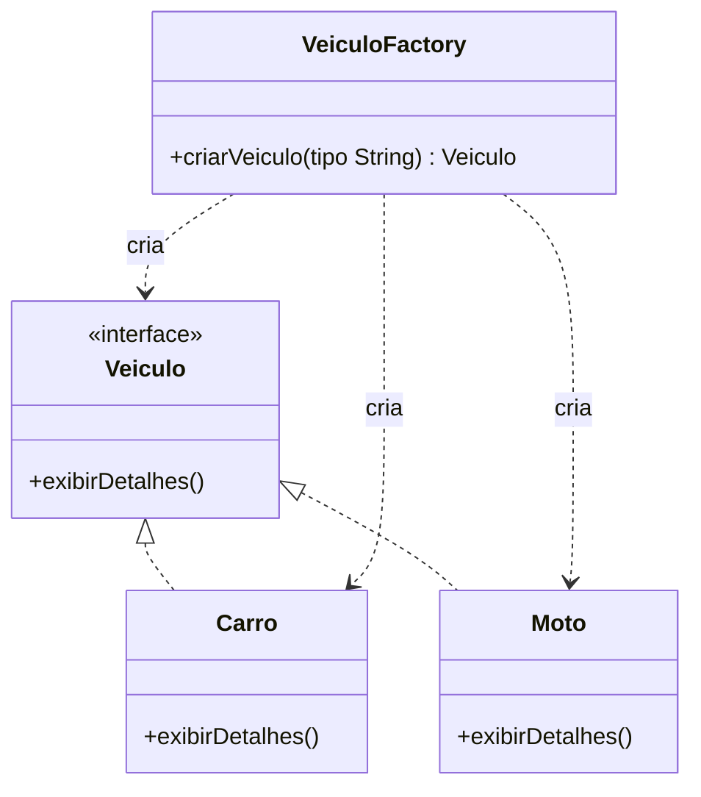

# Padrões de Criação em Java: Factory Method e Abstract Factory

Projeto acadêmico em **Java (Swing)** que implementa e compara dois padrões de
projeto criacionais do GoF (*Design Patterns: Elements of Reusable
Object-Oriented Software*, Gamma, Helm, Johnson & Vlissides):

- **Factory Method** — pacote [`factorymethod`](src/factorymethod)
- **Abstract Factory** — pacote [`abstractfactory`](src/abstractfactory)

## Estrutura do repositório

```
src/
 ├─ factorymethod/
 │   ├─ Veiculo.java          (interface / Produto)
 │   ├─ Carro.java            (Produto Concreto)
 │   ├─ Moto.java             (Produto Concreto)
 │   ├─ VeiculoFactory.java   (Factory Method)
 │   └─ Main.java             (Cliente, com GUI Swing)
 └─ abstractfactory/
     ├─ Sedan.java            (Abstract Product)
     ├─ Hatch.java            (Abstract Product)
     ├─ SUV.java              (Abstract Product - adicionado na Parte 3)
     ├─ FiatCronos.java       (Produto Concreto - família Fiat)
     ├─ FiatArgo.java         (Produto Concreto - família Fiat)
     ├─ FiatPulse.java        (Produto Concreto - família Fiat, Parte 3)
     ├─ VolksVirtus.java      (Produto Concreto - família Volkswagen)
     ├─ VolksPolo.java        (Produto Concreto - família Volkswagen)
     ├─ VolksTCross.java      (Produto Concreto - família Volkswagen, Parte 3)
     ├─ MontadoraFactory.java (Abstract Factory)
     ├─ FiatFactory.java      (Concrete Factory)
     ├─ VolksFactory.java     (Concrete Factory)
     └─ Main.java             (Cliente, com GUI Swing)
```

## Parte 1 — Factory Method

- `Veiculo` define o contrato `exibirDetalhes()`.
- `Carro` e `Moto` implementam esse contrato.
- `VeiculoFactory.criarVeiculo(String tipo)` encapsula a decisão de qual
  classe concreta instanciar (`"CARRO"` → `Carro`, `"MOTO"` → `Moto`).
- Em `Main`, o cliente nunca escreve `new Carro()` nem `new Moto()`: ele
  sempre passa pela fábrica, o que reduz o acoplamento entre o código
  cliente e as classes concretas.

## Parte 2 — Abstract Factory

- `Sedan` e `Hatch` são os **produtos abstratos**.
- Cada montadora (Fiat, Volkswagen) tem suas próprias implementações
  concretas desses produtos (`FiatCronos`/`FiatArgo`,
  `VolksVirtus`/`VolksPolo`).
- `MontadoraFactory` é a **fábrica abstrata**, com um método de criação
  para cada tipo de produto da família.
- `FiatFactory` e `VolksFactory` são as **fábricas concretas**: cada uma
  garante que os produtos criados pertencem sempre à mesma família
  (marca), evitando misturar, por exemplo, um sedã Fiat com um hatch
  Volkswagen.

## Parte 3 — O desafio do novo produto (SUV)

Ao tentar adicionar o SUV à fábrica abstrata existente, o problema
clássico do Abstract Factory ficou evidente:

- A interface `SUV` foi criada e as classes `FiatPulse` e `VolksTCross`
  a implementaram sem dificuldade — isso é só "mais um produto".
- O problema real apareceu na interface `MontadoraFactory`: para que as
  fábricas pudessem criar o novo produto, foi **obrigatório alterar a
  interface da fábrica abstrata**, acrescentando `SUV criarSUV()`.
- Essa alteração **quebra o Princípio Aberto/Fechado (Open/Closed
  Principle)**: toda fábrica concreta já existente (`FiatFactory`,
  `VolksFactory`) precisou ser modificada para implementar o novo
  método. Se houvesse mais montadoras no sistema (ex.: `ChevroletFactory`),
  todas elas parariam de compilar até implementarem `criarSUV()`.
- Esse é um trade-off conhecido do Abstract Factory: o padrão facilita
  **adicionar novas famílias** (uma nova montadora inteira, sem tocar no
  código existente), mas **dificulta adicionar um novo produto** a
  todas as famílias já existentes, pois isso exige alterar a interface
  da fábrica e, em cascata, todas as suas implementações.
- Uma alternativa mais flexível para cenários em que novos tipos de
  produto aparecem com frequência seria combinar Abstract Factory com
  Factory Method por tipo de produto, ou usar um registro dinâmico de
  criadores (ex.: `Map<String, Supplier<Veiculo>>`), pagando em troca
  uma perda de segurança em tempo de compilação.

## Diagrama de Classes (UML)

```mermaid
classDiagram
    class MontadoraFactory {
        <<interface>>
        +criarSedan() Sedan
        +criarHatch() Hatch
        +criarSUV() SUV
    }

    class FiatFactory {
        +criarSedan() Sedan
        +criarHatch() Hatch
        +criarSUV() SUV
    }

    class VolksFactory {
        +criarSedan() Sedan
        +criarHatch() Hatch
        +criarSUV() SUV
    }

    class Sedan {
        <<interface>>
        +exibirPortaMalas()
    }

    class Hatch {
        <<interface>>
        +exibirConsumo()
    }

    class SUV {
        <<interface>>
        +exibirAltura()
    }

    class FiatCronos {
        +exibirPortaMalas()
    }
    class FiatArgo {
        +exibirConsumo()
    }
    class FiatPulse {
        +exibirAltura()
    }

    class VolksVirtus {
        +exibirPortaMalas()
    }
    class VolksPolo {
        +exibirConsumo()
    }
    class VolksTCross {
        +exibirAltura()
    }

    MontadoraFactory <|.. FiatFactory
    MontadoraFactory <|.. VolksFactory

    Sedan <|.. FiatCronos
    Hatch <|.. FiatArgo
    SUV <|.. FiatPulse

    Sedan <|.. VolksVirtus
    Hatch <|.. VolksPolo
    SUV <|.. VolksTCross

    FiatFactory ..> FiatCronos : cria
    FiatFactory ..> FiatArgo : cria
    FiatFactory ..> FiatPulse : cria

    VolksFactory ..> VolksVirtus : cria
    VolksFactory ..> VolksPolo : cria
    VolksFactory ..> VolksTCross : cria
```



### Diagrama do Factory Method (Parte 1)



## Como compilar e executar

Requer JDK 8 ou superior.

```bash
# Factory Method
javac -d bin src/factorymethod/*.java
java -cp bin factorymethod.Main

# Abstract Factory
javac -d bin src/abstractfactory/*.java
java -cp bin abstractfactory.Main
```

Cada `Main` abre uma pequena janela Swing com botões para acionar as
fábricas e mostrar, em uma área de texto, o resultado de
`exibirDetalhes()` / `exibirPortaMalas()` / `exibirConsumo()` /
`exibirAltura()`.

## Referências

- GAMMA, E.; HELM, R.; JOHNSON, R.; VLISSIDES, J. *Design Patterns:
  Elements of Reusable Object-Oriented Software*. Addison-Wesley, 1994.
- Refactoring.Guru — [Factory Method](https://refactoring.guru/design-patterns/factory-method) e
  [Abstract Factory](https://refactoring.guru/design-patterns/abstract-factory).
- Oracle — [The Java™ Tutorials: Interfaces](https://docs.oracle.com/javase/tutorial/java/IandI/createinterface.html).

---

**Nome do aluno:** _(preencher antes de entregar)_
