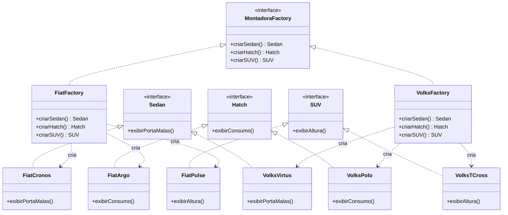
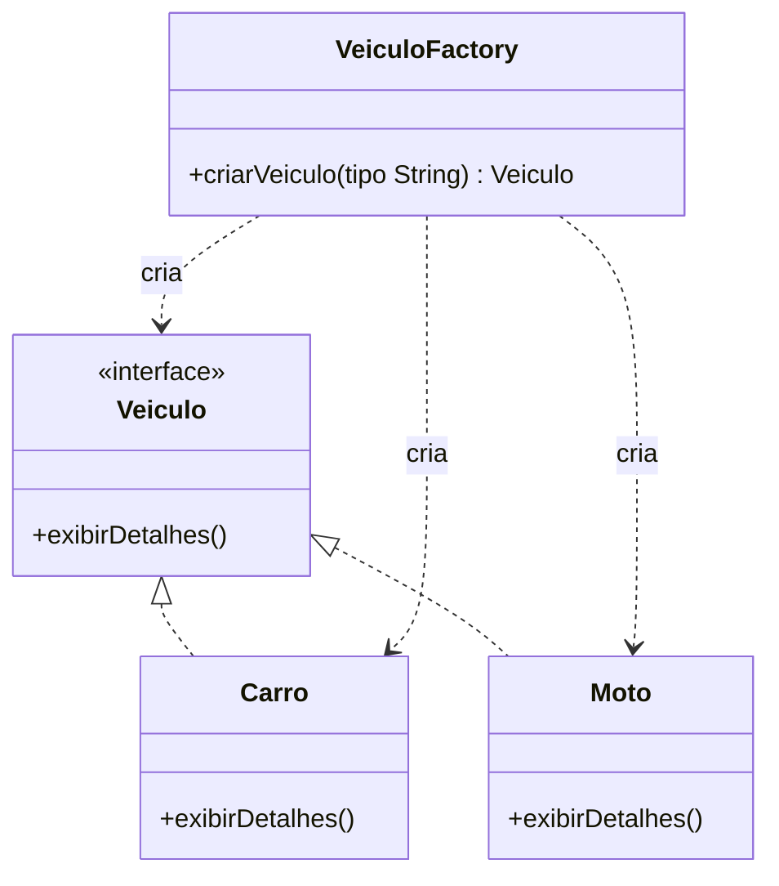

# Factory Method e Abstract Factory

Projeto que implementa e compara dois padrões de
projeto criacionais do GoF.

- **Factory Method** — pacote [`factorymethod`](src/factorymethod)
- **Abstract Factory** — pacote [`abstractfactory`](src/abstractfactory)

## Factory Method

Veiculo define o contrato exibirDetalhes().

Carro e Moto implementam esse contrato.

VeiculoFactory.criarVeiculo(String tipo) encapsula a decisão de qual classe concreta instanciar ("CARRO" = Carro, "MOTO" = Moto).

Em Main, o cliente não escreve new Carro() nem new Moto(), o que reduz o acoplamento entre o código cliente e as classes concretas.

## Abstract Factory

Sedan e Hatch são os produtos abstratos.

Cada montadora tem suas próprias implementações concretas desses produtos (FiatCronos/FiatArgo, VolksVirtus/VolksPolo).

MontadoraFactory é a fábrica abstrata, com um método de criação para cada tipo de produto da família.

FiatFactory e VolksFactory são as fábricas concretas, cada uma garante que os produtos criados pertencem sempre à mesma família de marca, evitando misturar.

## Novo produto (SUV)

Ao tentar adicionar o SUV à fábrica abstrata que ja existe, tem o problema do Abstract Factory

A interface SUV foi criada e as classes FiatPulse e VolksTCross a implementaram sem dificuldade (isso é só mais um produto).
O problema apareceu na interface MontadoraFactory: para que as fábricas pudessem criar o novo produto, foi obrigatório alterar a interface da fábrica abstrata, acrescentando SUV criarSUV().
Essa alteração quebra o Princípio Aberto/Fechado e toda fábrica concreta que já existe precisou ser modificada para implementar o novo método. Se houvesse mais montadoras no sistema (ex.: ChevroletFactory), todas elas parariam de compilar até implementarem criarSUV().
Então esse padrão facilita adicionar novas famílias (como uma nova montadora inteira) sem tocar no código existente, mas deixa mais difícil adicionar um novo produto a todas as famílias que já existem, porque isso exige alterar a interface da fábrica e, em cascata, todas as suas implementações.
Uma forma diferente para cenários em que novos tipos de produto aparecem com frequência seria combinar Abstract Factory com Factory Method por tipo de produto, ou usar um registro dinâmico de criadores, mas aceitando a perda de segurança em tempo de compilação.

## Diagrama de Classes (UML)

### Diagrama do Factory Method (Parte 1)

Cada Main abre uma pequena janela Swing com botões para acionar as
fábricas e mostrar, em uma área de texto.

## Referências

- GAMMA, E.; HELM, R.; JOHNSON, R.; VLISSIDES, J. *Design Patterns:
  Elements of Reusable Object-Oriented Software*. Addison-Wesley, 1994.
- Refactoring.Guru — [Factory Method](https://refactoring.guru/design-patterns/factory-method) e
  [Abstract Factory](https://refactoring.guru/design-patterns/abstract-factory).
- Oracle — [The Java™ Tutorials: Interfaces](https://docs.oracle.com/javase/tutorial/java/IandI/createinterface.html).

---

**Nome do aluno:**Desiree Barboza
